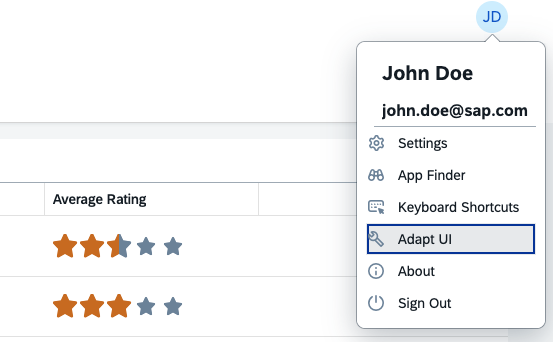
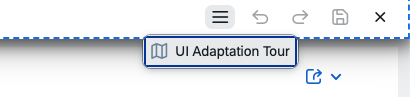
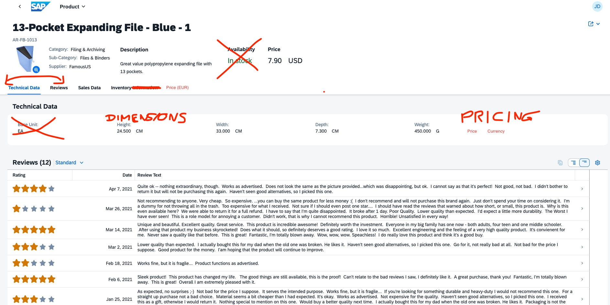

# Key User Adaptation in the demo kit

By the end of this chapter, you will be familiar with the most common actions of key user adaptation and the tooling itself.

## 1. Open an application in the demo kit

Start the [Key User Adaptation for Fiori elements](https://ui5.sap.com/test-resources/sap/ui/demoapps/demokit/rta/fe/test/index.html?sap-ui-theme=sap_horizon#masterDetail-display) app.
Start key user adaptation by selecting the user menu (represented by the circle named "JD" (John Doe)) in the top-right corner, then selecting "Adapt UI" in the resulting dropdown.

## 2. Start the UI Adaptation tour

The UI Adaptation tour provides a quick overview of the most important features in the toolbar. Trigger it via the "burger menu", then go through the individual items to learn more.

The entries in the tour are system-dependend - one important feature (transporting changes) is not available in the demokit, and will be explained later.

## 3. Try to achieve a target picture

Imagine the following scenario: You're a key user, and the end user council has decided that one of the application you're responsible for needs an overhaul. They've summarized the changes in a screenshot for your convenience.

Elements that are crossed out are no longer required in the UI. Others are to be moved, while some elements are to be added to or grouped in the UI.

Hint: The new section ("Price (EUR)") is realized via an iframe, using the following URL: https://themoneyconverter.com/MoneyConverter?from=USD&to=EUR&amount=XXX where "XXX" is to be replaced by the product's price.

### 3.1 Solution

* The "Availability" header element can be removed by (right-)clicking on the element, then selecting "Remove" from the context menu.
* The "Base Unit" entry can be removed by (right-)clicking on the element, then selecting "Remove" from the context menu. Since this field is marked as "mandatory", its removal has to be confirmed via the popup.
* To change the name of the "Inventory Information" section to "Inventory", (right-)click on the section title in the horizontal bar, then select "Rename" from the context menu. In the resulting dialog, adapt the name accordingly.
* To create a new form group called "Dimensions", (right-)click somewhere in the "Technical Data" form, then select "Create: Group" from the context menu. Name the new group appropriately via the resulting dialog. Move the three corresponding fields, "Height", "Width", and "Depth" to the newly-created group via drag and drop.
* To create the "Pricing" Group, repeat the last step. Instead of moving existing fields to the new group, (right-)click on the new "Pricing" Group, then select "Add: Field". From the resulting dialog, select "Price per Unit" and "Currency". Afterwards, rename the "Price per Unit" field to "Price".
* To switch the order of the "Technical Data" and "Reviews" sections, simply drag one of the two around in the horizontal bar containing the section titles.
* To add the iframe named "Price (EUR)", (right-)click somewhere in the blank space in the right to the header elements OR on a section title, then select "Embed content: as section" from the context menu. As *title*, enter "Price (EUR)", for *URL* enter "https://themoneyconverter.com/MoneyConverter?from=USD&to=EUR&amount=" and click on the "Price" entry in the *Available Values* to append the {Price} template variable to the URL. The resulting URL should be https://themoneyconverter.com/MoneyConverter?from=USD&to=EUR&amount={Price}. Verify the URL is correct by triggering the *Preview*. Feel free to adapt the iframe dimensions by trying different values for *width* and *height*.
