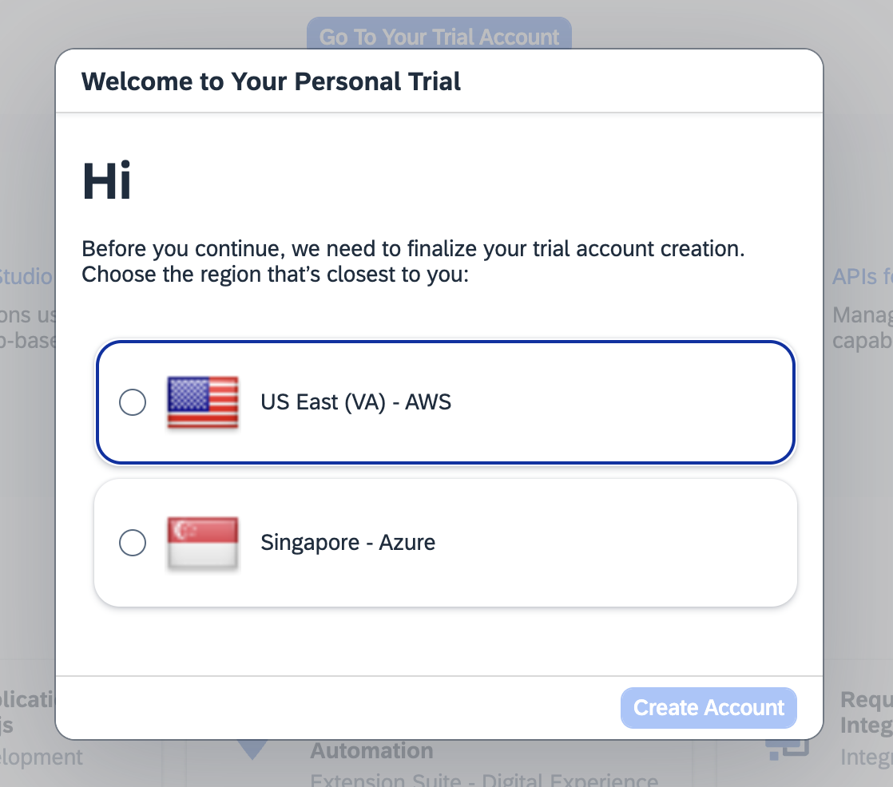
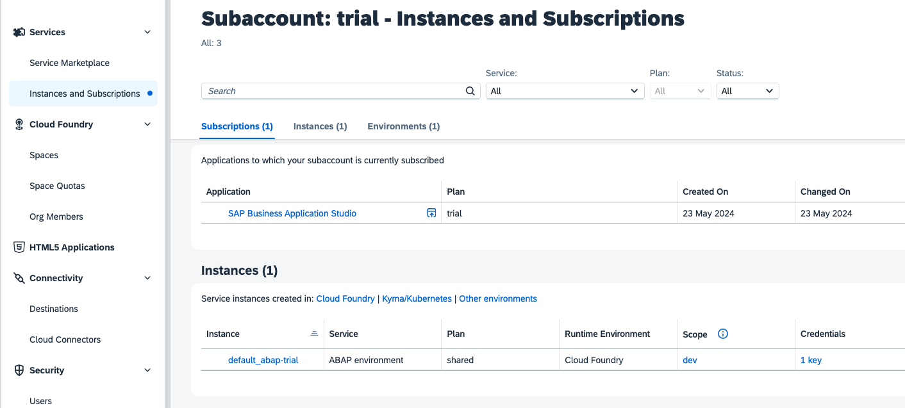

# Preparing the Development Environment

By the end of this chapter, you'll have your development environment ready to start developing your flex-enabled SAPUI5 application.

## Prerequisites for SAP Business Application Studio

To follow the instructions in this repository, you need to meet the following requirements:

### 1. Create a trial account on SAP BTP in US10

To create a trial account please follow [this tutorial](https://developers.sap.com/tutorials/hcp-create-trial-account.html).

> [!IMPORTANT]   
> Make sure you choose the option **US East (VA) - AWS**

### 2. Create an SAP BTP ABAP Environment Trial User and Set Up your SAP Business Application Studio

Next you need to prepare your environment, use the corresponding tutorial [Create an SAP BTP ABAP Environment Trial User](https://developers.sap.com/tutorials/abap-environment-trial-onboarding.html).

And the best part? You only need this one booster because it creates both a SAP BTP, ABAP environment and sets up your SAP Business Application Studio.

Verify your successful setup by navigating to your **Global Account** > **Trial Subaccount** > **Services** > **Instances and Subscriptions** tab in your SAP BTP cockpit. You should see both a SAP Business Application Studio subscription and an instance of the ABAP environment, like this:

## Prerequisites for Backend Integration

To deploy SAPUI5 applications to the SAP BTP, ABAP environment and them in the SAP Fiori Launchpad, you need to meet the following requirements:

### 1. Download ABAP Development Tools (ADT)

Download and install the latest ABAP Development Tools (ADT) by following the steps in this link: [https://tools.hana.ondemand.com/#abap](https://tools.hana.ondemand.com/#abap)

### 2. Connect your SAP BTP, ABAP environment with your ABAP Development Tools

In your ABAP Development Tools create an ABAP Cloud Project by following this tutorial: [Create an ABAP Cloud Project](https://developers.sap.com/tutorials/abap-environment-create-abap-cloud-project.html).

Continue to [Chapter 1.1 - Create a Dev Space in your SAP Business Application Studio](/chapters/1.1-open-BAS)
