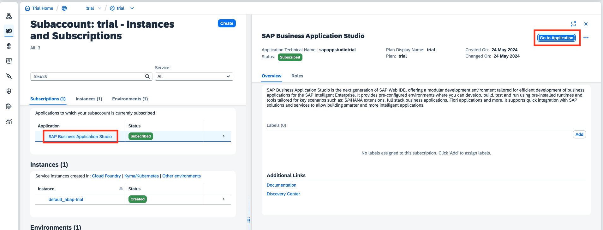
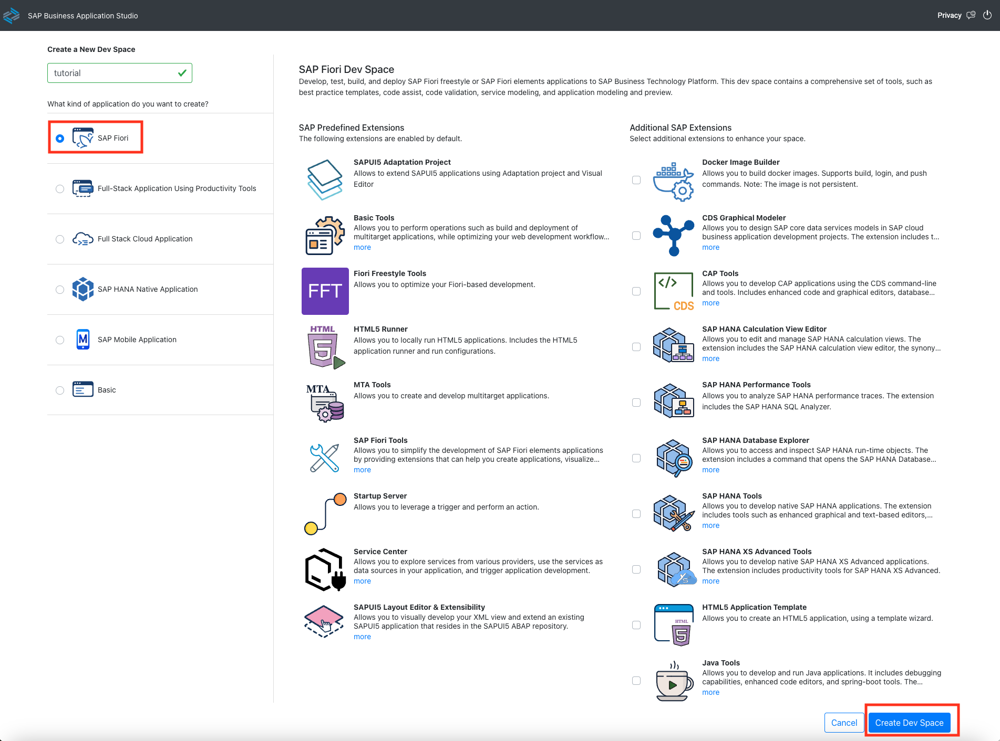
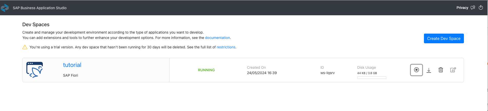

# Create a Dev Space in your SAP Business Application Studio

## 1. Open your SAP Business Application Studio

Navigate to your **Global Account** > **Trial Subaccount** > **Instances and Subcriptions**. You can either directly click on the linked **SAP Business Application Studio** or navigate to the Detail Page and click the **Go to Application** button.




## 2. Create a dev space

When you first open BAS, you'll need to confirm the terms and conditions. On the Business Application Studio screen that appears, click the "Create Dev Space" button. Name your dev space according to your preferences. For this tutorial, we select the "SAP Fiori" dev space, but you can choose any space that suits your needs.



SAP Business Application Studio will create the space for you. Once it is ```RUNNING``` open your dev space.




Now you're ready to get started!
