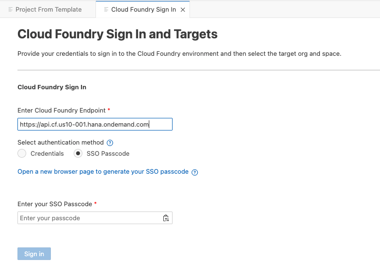
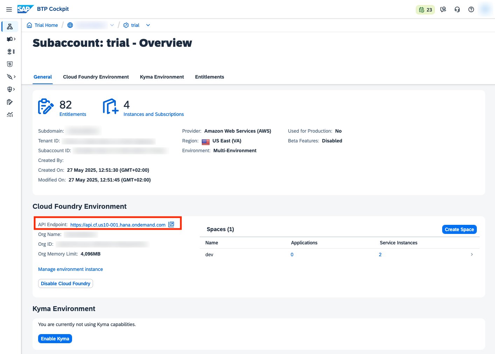
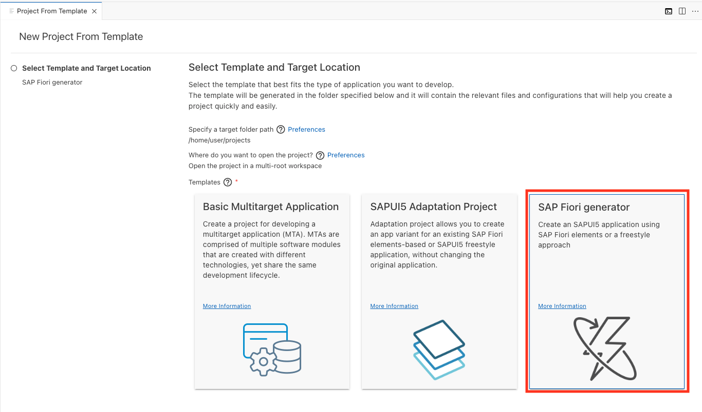
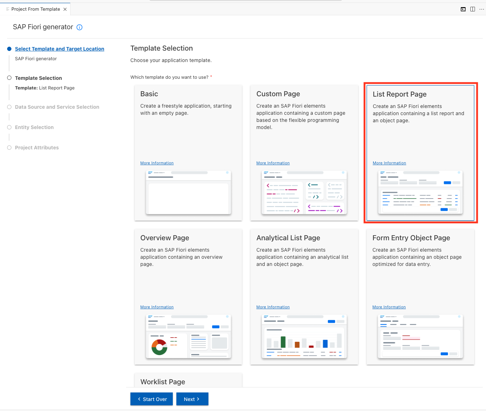
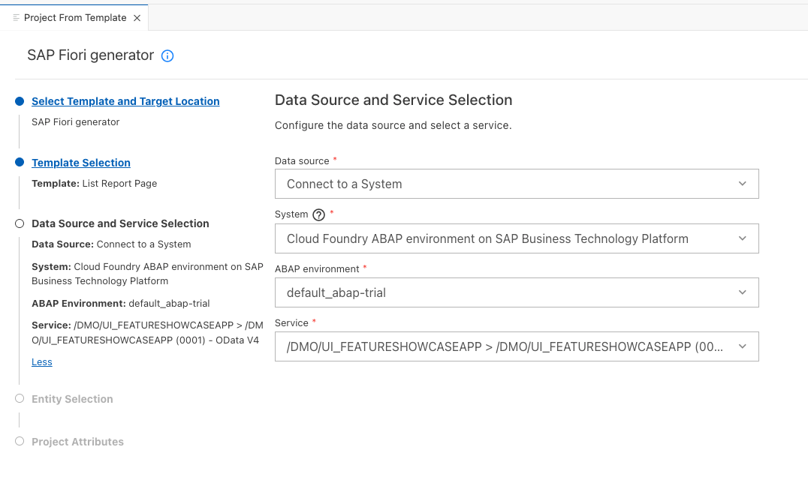
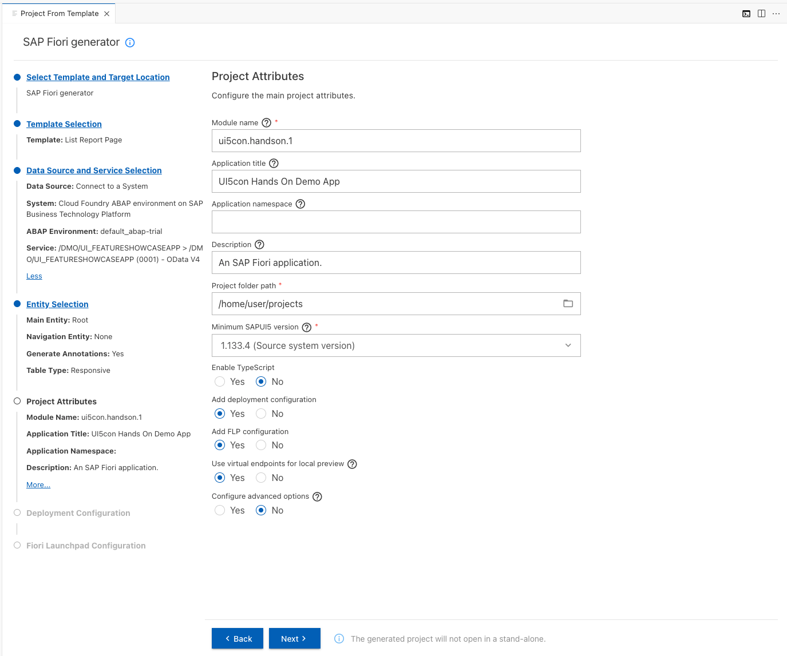
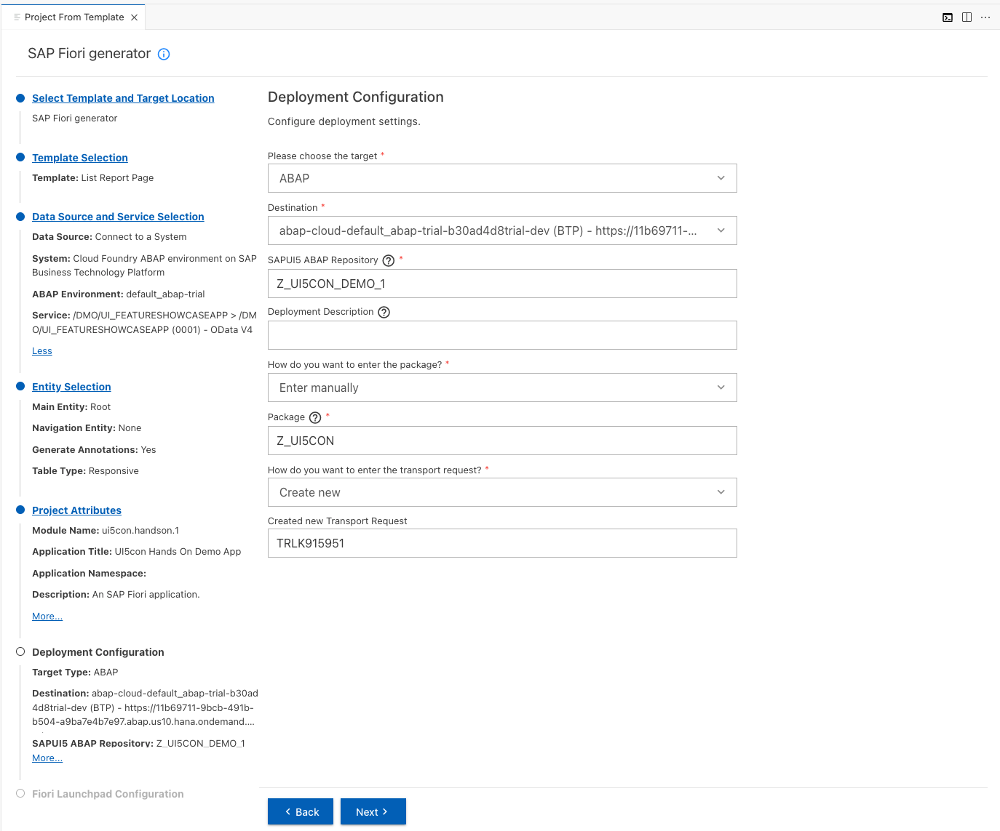
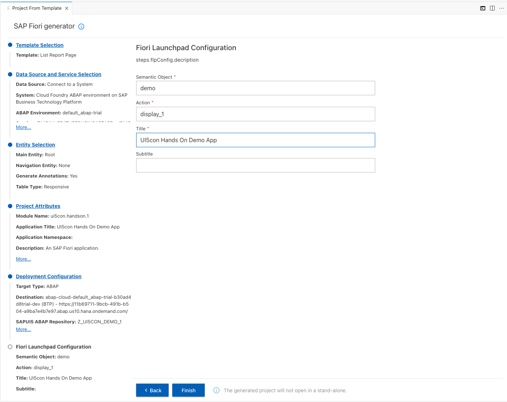
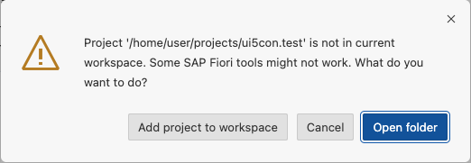
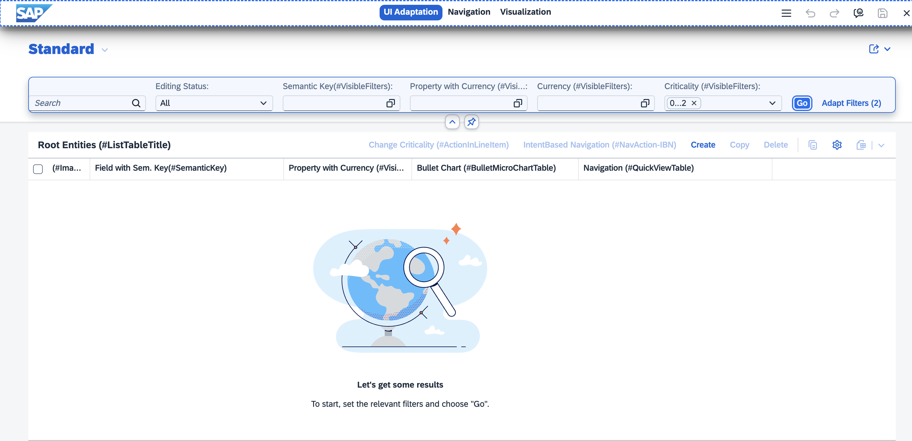

# Add SAP Fiori Elements UIs

## 1. Login to your Cloud Foundry environment

1. Choose the burger menu and then choose View > Command Palette. Type in "CF: Login to Cloud Foundry" and select this entry from the list.

    You can also invoke the Command Palette quickly using the following key combination:

    >For macOS: Command + Shift + P </br>
    >For Windows: Ctrl + Shift + P

2. Enter your Cloud Foundry Endpoint
    

    You can find your endpoint inside the cockpit. Navigate to your **Global Account** > **Trial Subaccount** under **Cloud Foundry Environment**, for example
    https://api.cf.us10-001.hana.ondemand.com

    

3. Click on the link **Open a new browser page to generate your SSO passcode**
You will be prompted to login to your identity provider. If you are already logged in, you will see a temporary passcode which you can copy.

4. Enter the SSO Passcode and click on **Sign In**

5. Select your **Cloud Foundry Target** by choosing the CF org and space of your trial account, and click "Apply".


## 2. Generate the UI with an SAP Fiori Elements template


1. Open the SAP Fiori Generator by selecting it in "Project from Template" and clicking on **Start**



2. In the **Template Selection** step:

    Choose the **List Report Page** template tile.

    Choose **Next**.
    

3. In the **Data Source and Service Selection** step:
    In the Data source dropdown menu, select **Connect to a System**.
    In the System dropdown menu, select **Cloud Foundry ABAP environment on SAP Business Technology Platform**
    In the Service dropdown, select **/DMO/UI_FEATURESHOWCASEAPP**
	
> [!IMPORTANT]
> Make sure you have logged into your CF environment, see step 1. Otherwise you will get an error at this point

4. In the background a new destination "default_abap-trial" to your BTP ABAP environment will be created.
    

5. In the **Entity Selection** step:
   Keep everything as is and click on **Next**

6. In the **Project Attributes** step:
   Select a unique **module name**.
	 > **Hint**: This module name is required in the next chapter, so pick something easy to remember.

   For **Add deployment configuration**, select **Yes**.

   For **Add FLP configuration**, select **Yes**.
    

7. In the **Deployment Configuration** step:

   Enter a unique **SAPUI5 ABAP Repository**.

   For the package use **Z_UI5CON**.

   For the transport request select **Create new** from the dropdown
    

8. In the **FLP configuration** step:

    Enter a Semantic Object.

    Enter a **unique** Action.

    Enter a Title.
    

	> **Hint**: If your current SAP Business Application Studio dev space already contains an opened workspace, you will be prompted about the next step:

	> 

	> In this case, select *Open folder*.

## 3. Create a run configuration supporting key user adaptation

By default, the application previews do not contain the plugin required for UI adaptation. To see how any changes in the application appear to the key user, we want to be able to test this in the preview without having to deploy the application.

For this, open *package.json* (Cmd + P on MacOS, Ctrl + P on Windows), and scroll to the *scripts* section/object.
At the end, insert another run script, called "key user".

```json
"key-user": "fiori run --open \"preview.html?fiori-tools-rta-mode=false&sap-ui-xx-viewCache=false#app-preview\""
```

This script can now be used to preview the application, with UI adaptation started automatically.

## 4. Preview your application with key user adaptation

Open *package.json* (Cmd + P on MacOS, Ctrl + P on Windows), hover over the newly-added *key-user* script, then select *Run script* in the popover.

The application preview will open in a new tab. It should look like this:



Continue to [Chapter 2.1 - Create Custom Key User Action / Change Handler](/chapters/2.1-add-custom-section)
