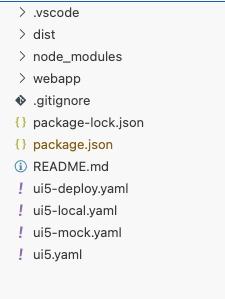
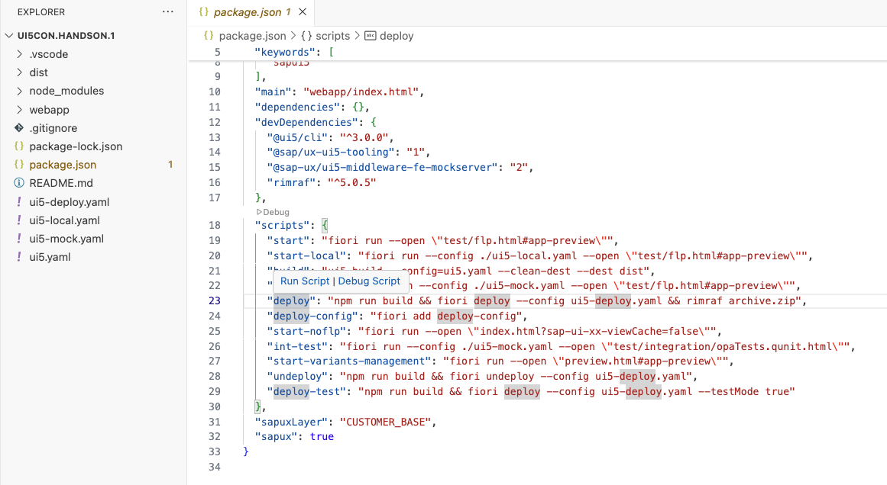
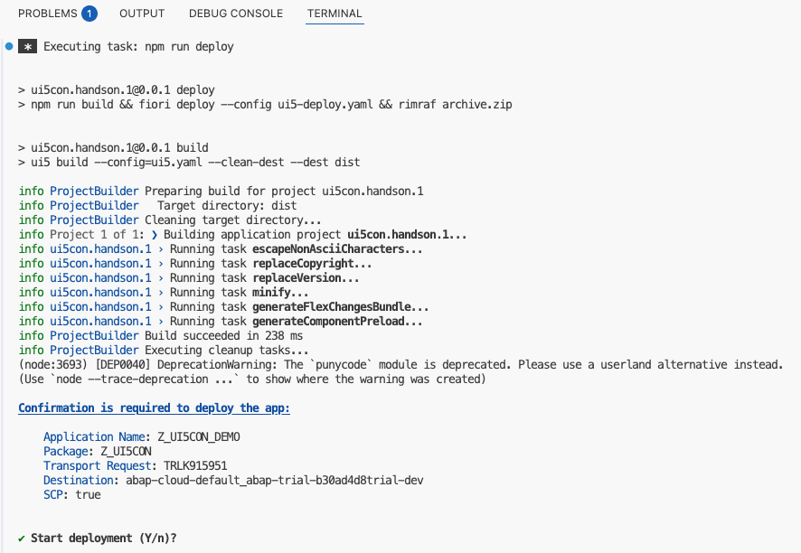
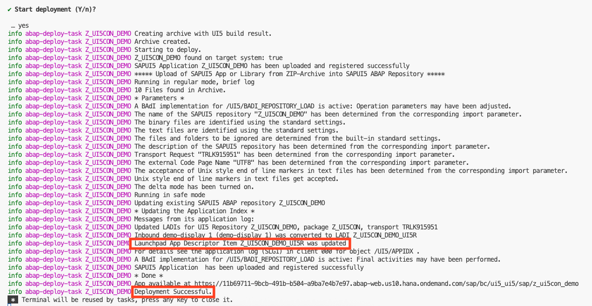

<!--
SPDX-FileCopyrightText: 2025 SAP SE or an SAP affiliate company and ui5-flexibility-easy-key-user-adaptation contributors

SPDX-License-Identifier: Apache-2.0
-->

# Deploy your SAP Fiori elements application to your BTP ABAP environment trial account

In this chapter, you will build and deploy your SAP Fiori elements application to your prepared trial SAP BTP, ABAP environment.


## 1. Prerequisites
Make sure you finished the following steps:
1. Login to your Cloud Foundry account in BAS, see [Chapter 2.0, step 1](/chapters/2.0-add-fiori-elements-ui/)
2. You have a `ui5-deploy.yaml` available in your workspace. If it is not available please run the command `npm run deploy-config`

	

## 2. Deployment

To deploy your application, you have two options:

1. Open the package.json file. Right-click on the *deploy* script and select *Run Script*.

	


2. Alternatively, open a terminal and enter the command: `npm run deploy`.

If you examine the command closely, you'll notice that the deployment executes three commands consecutively:
1. ```npm run build``` - which calls the @ui5/cli to build the application. During the build all the '-dbg' and '-preload' files are created.
2. ```fiori deploy --config ui5-deploy.yaml``` - which zips the content of the 'dist' folder into the 'archive.zip' and deploys the application via an OData service to your specified backend system
3. ```rimraf archive.zip``` - which deletes the 'archive.zip' that was created during the deployment so that you're left with a clean state.

When you run the "deploy" command, a terminal appears and runs the build command first. It then pauses, waiting for your final confirmation to proceed with deploying the application. In the terminal logs, you can see which tasks are executed during the build of the adaptation project.



Type "Y" to proceed.

The deployment is now taking place. If it's successful, you'll receive a detailed success message with everything that occurred in the backend. Two important pieces of information are included:

1. The successful creation of the Fiori Launchpad App Description Item.
2. The "Deployment Successful" message.

Please note that the message below pertains to a re-deployment, not a first-time deployment. Therefore, the message indicates that the items were updated, not created.



Continue to [Chapter 2.3 - Add your application to a catalog in ABAP Development Tools](/chapters/2.3-configure-flp-with-adt)
