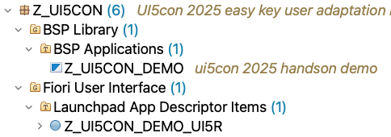
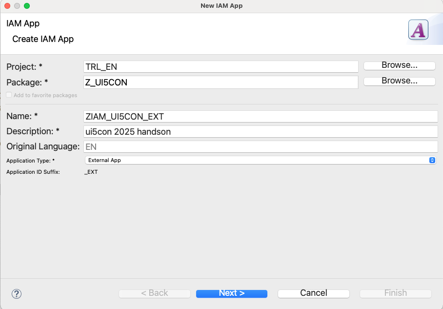
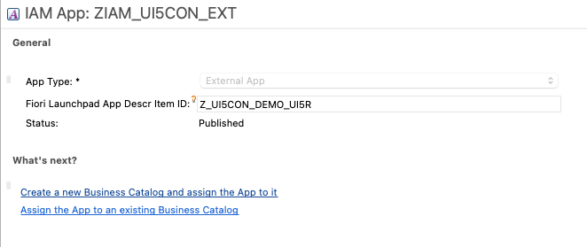
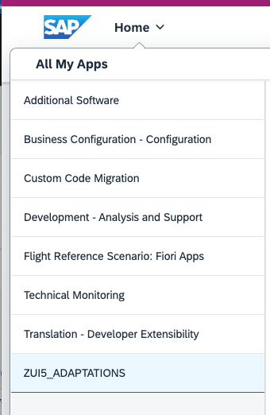
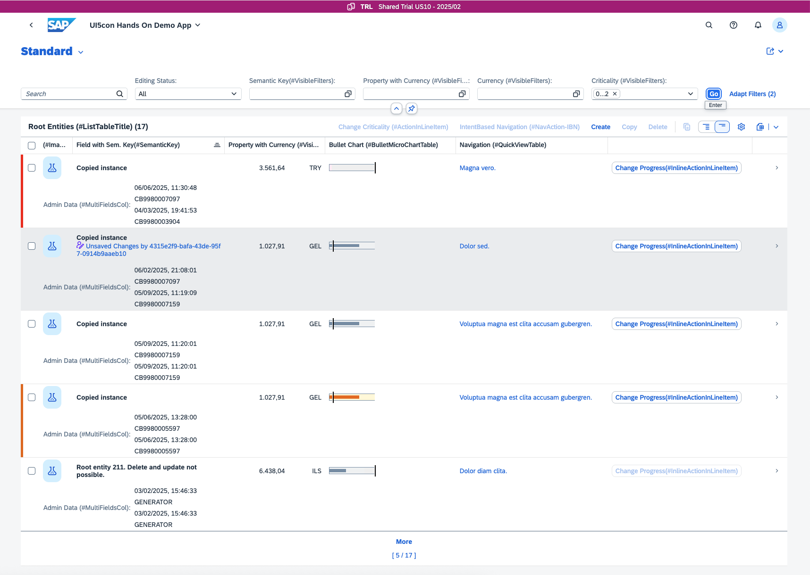

<!--
SPDX-FileCopyrightText: 2025 SAP SE or an SAP affiliate company and ui5-flexibility-easy-key-user-adaptation contributors

SPDX-License-Identifier: Apache-2.0
-->

# Add your application to a catalog in ABAP Development Tools

## 1. Find the new content

In ABAP development tools, locate the package which you have used to deploy your app (Z_UI5CON) and refresh the content list.

You will find some new content created by the deployment:

- A BSP application which is the technical container of the deployed app
- A Launchpad App Descriptor Item which contains the tile and target mapping that has been defined in the project wizard. It has the same name as the UI5 Repository with the suffix _UI5R

In addition, 2 ICF nodes are created which are used to access the content at runtime.

## 2. Create an IAM Application

1. Copy the ID of the Launchpad App Descriptor Item (it should end with ' _UI5R') as you will need it later.
2. Right click the package and choose **New** > **Other ABAP Repository Object** > **IAM App**.
3. Provide a name and description. You can use the same name as for the UI5 repository
4. Set **Application Type** to **External App**

    

5. On the next step specify your transport and click on 'Finish'

6. Open the IAM App and specify the ID of the Launchpad App Descriptor Item
    

7. Go to **Services** tab and click on **Synchronize**
8. Go to **Authorizations** tab and click on **Synchronize**
9. Go back to **Overview** page and click on **Publish Locally**

## 3. Assign Business Catalog

1. If you have not done so in step 6 above, open the IAM App by double clicking on it
2. Click on **Assign the App to an existing Catalog**
3. Enter **ZUI5_ADAPTATIONS** as Business Catalog name.
This catalog is already assigned to a business role which is assigned to your user.
4. On the next page, specify your transport and click on 'Finish'

Now you should be able to open your deployed application in your SAP Fiori Launchpad!

## 4. Open your application in your FLP

1. Navigate to your **Global Account** > **Trial Subaccount** > **Instances and Subcriptions**. On the **Instance** page, click on the linked **default_abap-trial** entry.
2. Open the **Home** navigation and select the business catalog "ZUI5_ADAPTATIONS". Here you should already see your application!

    
3. Open your application and take a moment to celebrate. You've successfully completed the most complicated steps of this tutorial.

    

Continue to [Chapter 3.0 - Layering](/chapters/3.0-layering)
