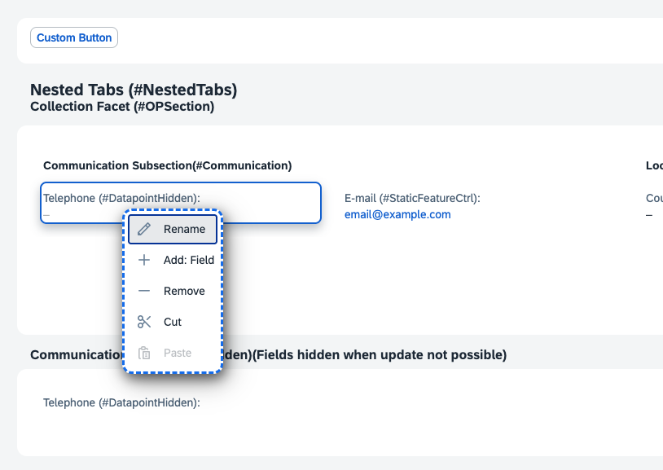

# Layering

This chapter will demonstrate the *layering* effect inherent in UI5 flexibility.

## Background

UI5 flexibility is offered for multiple personas, among them **developer** and **key user**. Developers are further divided into **internal** (layer: VENDOR) and **external** (layer: CUSTOMER_BASE). The next higher layer (CUSTOMER) belongs to the key user. Going up the layers, each layer potentially decreases the amount of affected end users. A change delivered by SAP (*VENDOR* layer) affects every user using the app, while a change by a customer developer (*CUSTOMER_BASE* layer) is able to override this change for a smaller audience (all employees of this company), etc. The highest layer belongs to the end user (layer: USER) - changes belonging to this layer only affect the user creating them (personalization).

### Precedence

All that is to say, that changes in higher layers have **precedence** over the same changes in lower layers - the rational is that the higher the layer, the closer the person making the change is to the end user, so they will know best about the end users' needs.

### Example

#### Create change as developer

In SAP Business Application Studio, start your generated application by opening *package.json*, then hovering over the *key-user* start script, and selecting *Run Script*. In the opened application, select the *Navigation* mode, click *Go* in the filter bar to trigger the search, then select an entry from the table below.

On the resulting object page, switch back to *Adaptation*, then click on the entry *Telephone (#DatapointHidden)* and select *Rename* in the resulting drop-down:

Provide a new name, e.g., "Phone no", then save your change via the save button (disk icon) in the toolbar.

In your SAP Business Application Instance, you can observe your created change in the *webapp/changes* folder. If you open it, you can see the *layer* -> *CUSTOMER_BASE*.

#### Deploy the app

From the *package.json*, click on the *deploy* start script, the select *Run Script*. Confirm the deployment in the terminal.

#### Create the same change as key user

Start your deployed application on the Steampunk system and navigate to the object page by selecting an entry from the table. On the object page, you can observe that the field (*Telephone (#DatapointHidden)*) has been renamed and the new name you provided above is visible.

Start UI Adaptation by clicking on the user menu in the top-right, then selecting "Adapt UI" in the menu.

Click on the renamed field, and select *Rename* from the context menu. Any new name that is provided now overrides the previous rename - after activating the version via the toolbar (magic wand icon), end users will only see the change created by the key user.

Continue to [Chapter 3.1 - Adapting the UI for specific user roles](/chapters/3.1-context-based-adaptation)