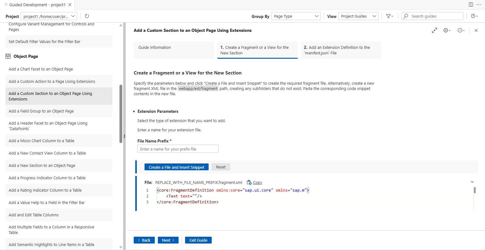

# Create Custom Key User Action / Change Handler

## Add a custom section to the application

The easiest way to add some custom flexibility behavior to certain controls is to add instance-specific designtime and flexibility information to a particular control instance. In Fiori elements applications all controls are generated according to the metadata provided, so we will use an extension point to create additional controls. This can easily be done using the Fiori Tools' 'Guided Development'. For the Object Page there is an option to 'Add a Custom Section to an Object Page Using Extensions'.



For step 1 you need to choose a name for the new fragment and click on the 'Create a File and Insert Snippet' button. Step 2 requires you to both select an Entity Set and Extension Point. For _Entity Set_ specify 'Root', for _Extension Point_ 'Before'. Next, select the section relative to which (in the current selection: before) the new section will be placed. For our example, select 'Nested Tabs (#NestedTabs)' for _Related Facets Annotation Term_. After entering the _Section Title_ follwed by clicking _Insert Snippet_, the new section can be seen in the preview of the application.

### Update the custom section

Due to the nature of the key user action we'll be implementing, the affected control should be wrapped in a container. For our simple approach, an `sap.m.HBox` will suffice.

```xml
<core:FragmentDefinition xmlns:core="sap.ui.core" xmlns="sap.m">
	<HBox id="customHBox">
		<Text text=""/>
	</HBox>
</core:FragmentDefinition>
```

## Create instance-specific designtime metadata

All actions that can be triggered by the Key User are defined in designtime metadata files, with almost all controls contributing such metadata. Such metadata can also be defined for one specific instance of a control, directly in the XML.

```XML
	<Button xmlns:dt="sap.ui.dt" id="customButton" dt:designtime="<module_name>/ext/CustomButton.designtime" />
```

> **Hint**: replace _<module_name>_ in the snippet above with the name of your project, defined in step [2.0 - Add SAP Firoi Element UIs](/chapters/2.0-add-fiori-elements-ui), paragraph 2, point 5, under 'Project Attributes'.

This metadata file can hold much more information than only the actions, see [here](https://ui5.sap.com/#/topic/5866a476fa4445ec953181354b383097). For our scenario we will use the [settings action](https://ui5.sap.com/#/topic/5483068f017049339e6a9e25f89f7074), which can be used for any type of change. For this action a handler function must be defined, which returns the data needed to create a Key User change.

The following sample creates an action with a specific name and icon, creates a change of type 'createNewButton' and passes some information along with it.


```js
{
	actions: {
		settings: {
			icon: "sap-icon://popup-window",
			name: "my custom action",
			async handler(oSelectedElement) {
				const sText = await prompt("Please enter a name.", "");
				return [{
					changeSpecificData: {
						changeType: "createNewButton",
						content: {
							text: sText
						}
					},
					selectorControl: oSelectedElement
				}];
			}
		}
	}
}
```

This snippet must be wrapped in a call to `sap.ui.define` and written to a file named _CustomButton.designtime.js_ in the _ext_ folder of your project. The full example can be found [here](/chapters/3.1-add-custom-section/src/CustomButton.designtime.js).

For this action to work we now need to create a change handler for that change type.

## Create instance-specific change handler

Change handlers can either be defined directly in library.js or, for convenience, in flexibility files that are referenced from library.js. Analogously to the designtime, it is possible to define instance-specific change handlers. Update your _Button_ definition to include a reference to _fl:flexibility_:

```js
	<Button xmlns:fl="sap.ui.fl" id="customButton" fl:flexibility="<module_name>/ext/custom.flexibility" />
```

> **Hint**: replace _<module_name>_ in the snippet above with the name of your project, defined in step [2.0 - Add SAP Firoi Element UIs](/chapters/2.0-add-fiori-elements-ui), paragraph 2, point 5, under 'Project Attributes'.

The reference file then contains the new change handler that is called during change creation and every time the change is applied (usually once per application start, or when switching variants). The three functions a change handler is required to have are 'applyChange', 'revertChange' and 'completeChangeContent', but there are more optional functions (see [here](https://ui5.sap.com/#/topic/6a346a293c724bd4bc33f0df92706008)).

First, the 'completeChangeContent' function is called during the change creation process. There, any specific content for the change needs to be saved to the change's 'content' property, which will also be persisted in the backend. The other functions are called when the change is applied or reverted. The 'applyChange' function creates a new control of type 'sap.m.Button' with the given name and adds it to the parent's 'items' aggregation. To enable _undo_, the necessary information to revert the change must be saved to the change instance. The revert then destroys the created control.

Changes can be applied both during XML Preprocessing and on an instantiated SAPUI5 control, which is why the passed control and the view are not always the same. To overcome this difference, the 'mPropertyBag' parameter passed to the change handler contains a module that serves as an abstraction to the underlying view or XML (mPropertyBag.modifier). There, many functions to manipulate controls or retrieve information are available, e.g., ‘createControl' or 'getParent'.


```js
{
	createNewButton: {
		changeHandler: {
			async applyChange(oChange, oControl, mPropertyBag) {
				const oParent = mPropertyBag.modifier.getParent(oControl);
				const aItems = await mPropertyBag.modifier.getAggregation(oParent, "items");
				const iNewIndex = aItems.length;
				const oNewButton = await mPropertyBag.modifier.createControl(
					"sap.m.Button",
					mPropertyBag.appComponent,
					mPropertyBag.view,
					{
						id: `newButton_${iNewIndex}`
					},
					{
						text: oChange.getContent().buttonText
					}
				);
				oParent.addItem(oNewButton);
				oChange.setRevertData({
					newControlId: `newButton_${iNewIndex}`
				});
			},
			completeChangeContent(oChange, mSpecificChangeInfo, mPropertyBag) {
				oChange.setContent({
					buttonText: mSpecificChangeInfo.text
				});
			},
			revertChange(oChange, oControl, mPropertyBag) {
				const oParent = mPropertyBag.modifier.getParent(oControl);
				const aItems = await mPropertyBag.modifier.getAggregation(oParent, "items");
				aItems.find(item => item.getId() === oChange.getRevertData().newControlId).destroy();
			}
		}
	}
}
```

This snippet must be wrapped in a call to `sap.ui.define` and written to a file named _CustomButton.flexibility.js_ in the _ext_ folder of your project. The full example can be found [here](/chapters/3.1-add-custom-section/src/CustomButton.flexibility.js).

Having created both the change handler (_ext/CustomButton.flexibility.js_), and the instance-specific designtime (_ext/CustomButton.designtime.js_), the finished fragment should look like [this](/chapters/3.1-add-custom-section/src/CustomButton.fragment.xml).