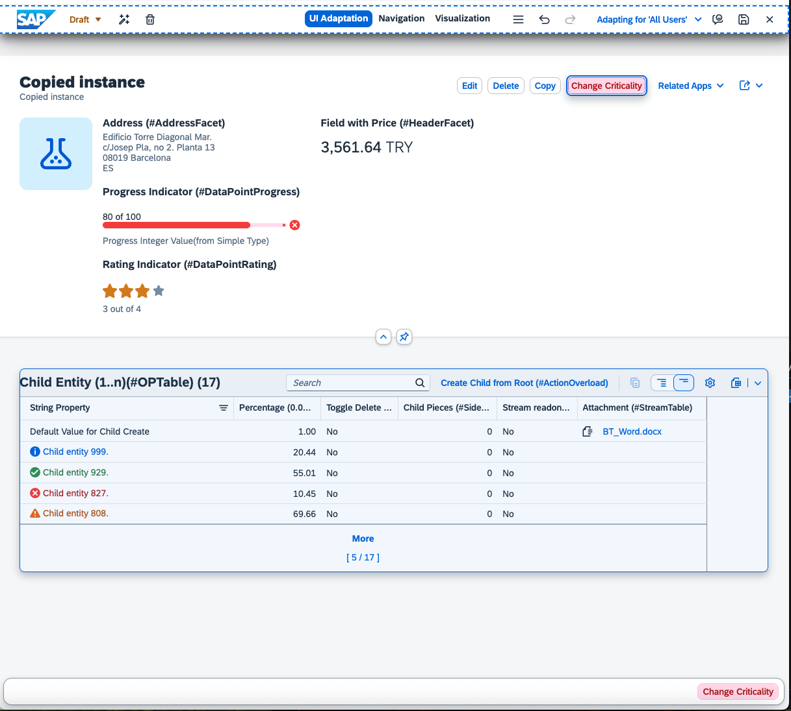
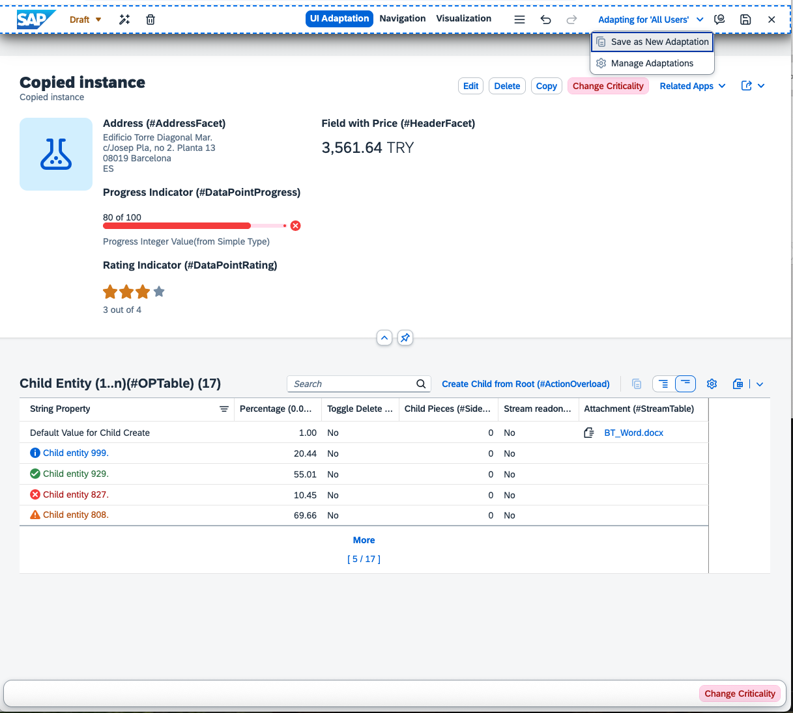
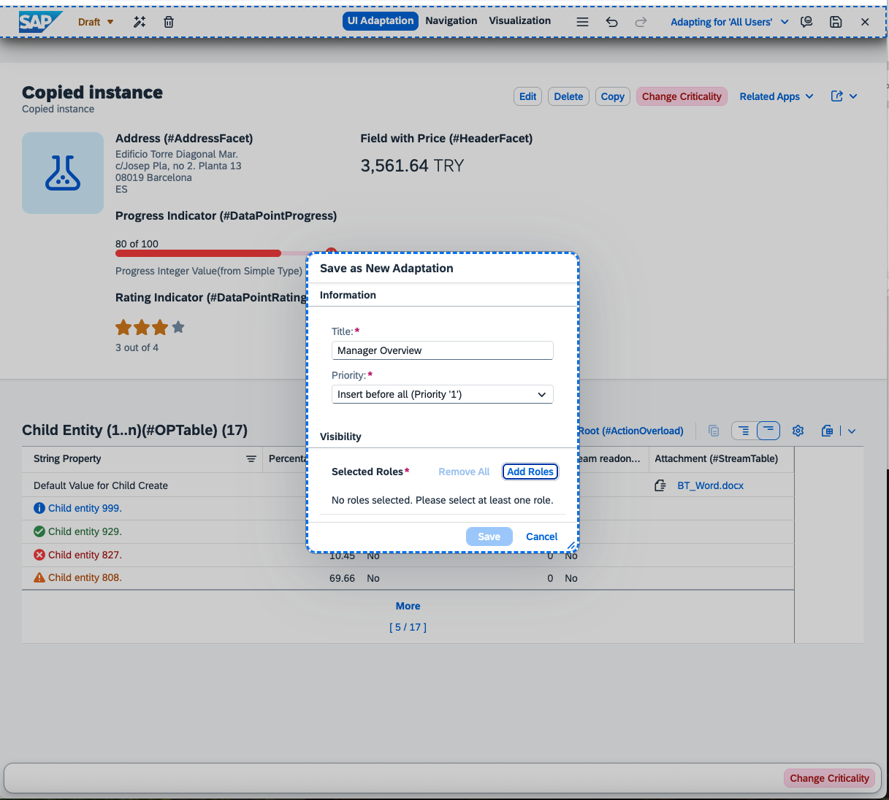
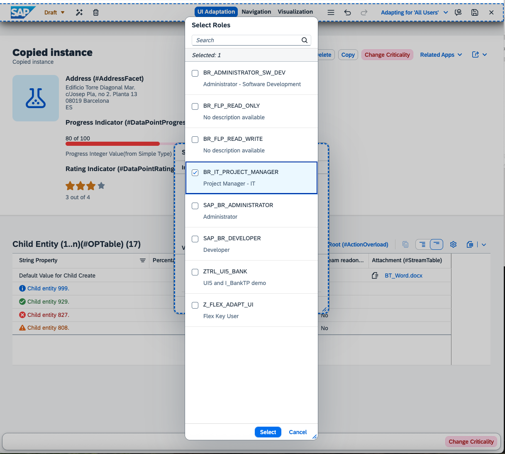
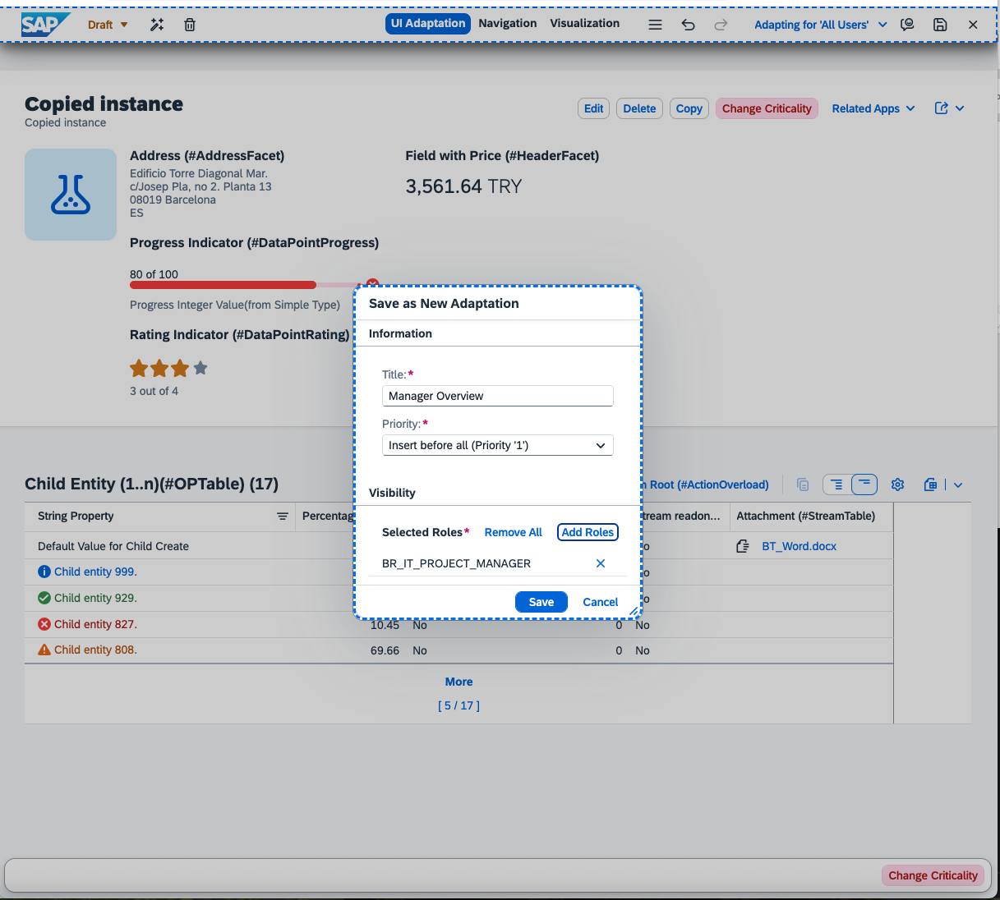
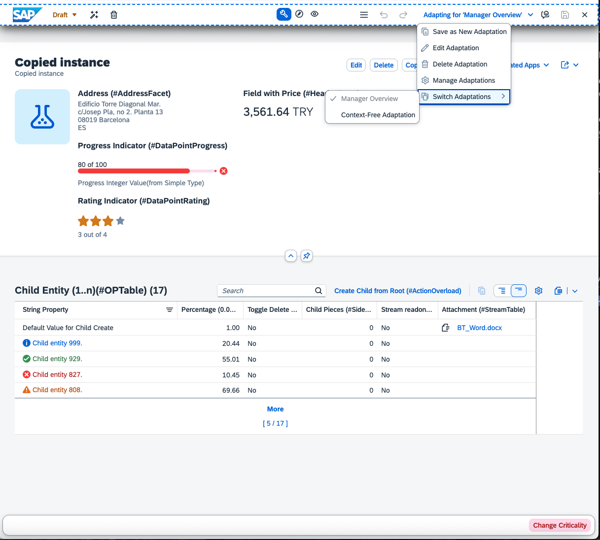
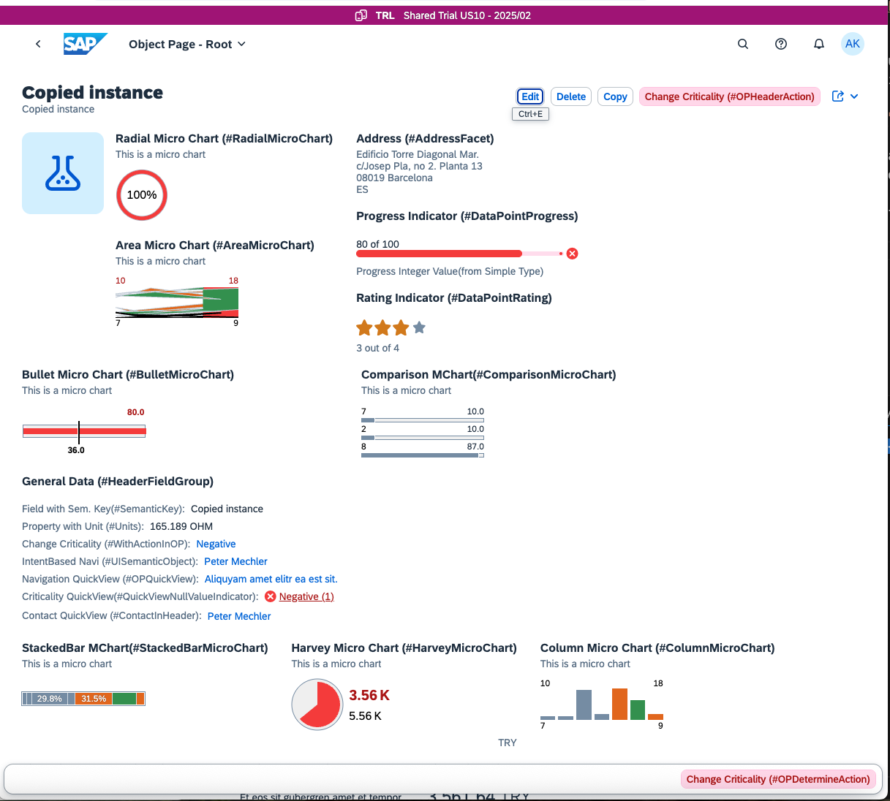
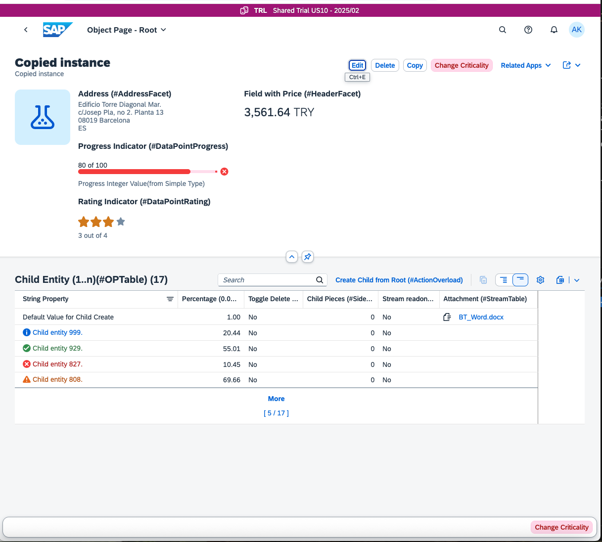

# Adapting the UI for specific user roles

## Create a screen with reduced content for managers

Imagine you're a key user for your favorite company. The IT department decides that the app you've created has too many details. They need an overview specifically for management. All other users of the application should still be able to see the details.

What do you do?

1. Make all necessary changes to achieve a simplified UI

    

2. Save your changes in a new adaptation. Assign the IT Manager role.

    2.1 In the toolbar, click on the dropdown labeled "Adapting for 'All Users'". Then, click on "Save as Adaptation."

    

    2.2 Add the mandatory *title*, such as "Manager Overview." This title is visible to you and other key users, but not to any end users.
    

    2.3 To add a role, click on the "Add Role" button. This action opens a new selection dialog that displays all available roles in the system. Locate and click on the "BR_IT_PROJECT_MANAGER" role, then click "Select".

    

    2.4 Save your newly-created role-based adaptation. You'll notice that the user interface reloads, and the toolbar now reads "Adapting for 'Manager Overview'." This indicates the process is successful.

   

4. You can now explore your adaptations. You have options to save another adaptation, edit existing ones, or switch between them.  
When switching between adaptations, note that you automatically have two adaptations: the "Manage Overview" you just created and the "context-free adaptation." The "context-free adaptation" serves users who don't have roles assigned to other adaptations. It derives from the original adaptation that existed before any context-based adaptations were created.

   

6. Activate your draft changes to make your adaptations available in the system. Click the activate button and enter your version name. This name is internal and only visible to key users.

   

7. Close key user adaptation. You'll receive a notification that the browser reloads with the adaptation that best fits your roles. Once the browser reloads, you return to being an end user. Since you're not assigned to the IT Manager role, you can only see the "context-free adaptation" and not the IT Manager adaptation.

    

 

> [!NOTE]   
> You will not be able to complete the last part of this tutorial on a trial system. You will need an ABAP system with administrator access.

In trial systems, users don't receive the admin role. This means they can't assign or unassign roles to their user at will.

As an admin, you can assign the IT Manager role to users. Open the "Maintain Business User" app and select the user. In the "Assigned Business Role" tab, add the IT Manager role.  

Here is a sample of what IT Managers with the correct role assignment see:

