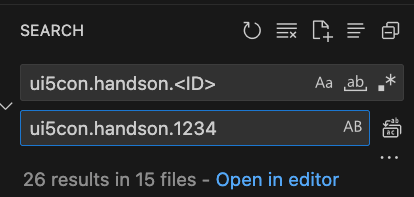
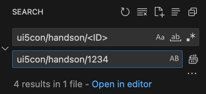

## Application Details

To use this application for the tutorial you have to 

1. replace the ID in all files!
   
   In the search field of your IDE, replace ui5con.handson.\<ID> and ui5con/handson/\<ID> with a unique number

   
   

2. in your ui5-x.yaml files replace:
   
   2.1. \<DESTINATION> with the destination name.  Go to your BTP **Global Account** > **Trial Subaccount** > **Connectivity** > **Destinations (New)** and copy the "Name".
   
   2.2 <ABAP_TRIAL_URL> with the actual trial URL. You can find it in the same Destination under "URL".

3. in your ui5-deploy.yaml replace:
   
   3.1 line 24 - <TRANSPORT> with the transport you can find in the ADT under **Transport Organizer**

   3.2 line 21 - Z_UI5CON_\<ID> with a unqiue name
   

## ui5con.handson.1

An SAP Fiori application.

### Starting the generated app

-   This app has been generated using the SAP Fiori tools - App Generator, as part of the SAP Fiori tools suite.  In order to launch the generated app, simply run the following from the generated app root folder:

```
    npm start
```

- It is also possible to run the application using mock data that reflects the OData Service URL supplied during application generation.  In order to run the application with Mock Data, run the following from the generated app root folder:

```
    npm run start-mock
```

#### Pre-requisites:

1. Active NodeJS LTS (Long Term Support) version and associated supported NPM version.  (See https://nodejs.org)


